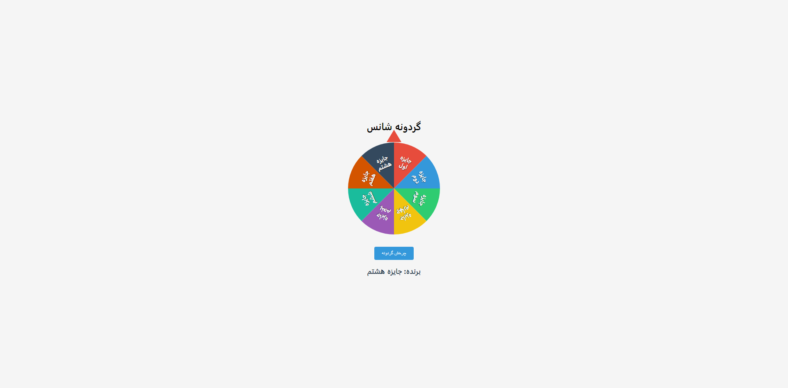

# گردونه شانس (Lucky Wheel)

یک پروژه ساده و جذاب برای ساخت گردونه شانس با استفاده از HTML، CSS و JavaScript (بدون هیچ کتابخانه خارجی) که می‌توانید برای قرعه‌کشی، بازی و سرگرمی یا آموزش مفاهیم برنامه‌نویسی از آن استفاده کنید.

## پیش‌نمایش



## ویژگی‌ها

- طراحی کاملاً واکنش‌گرا و مدرن
- استفاده از SVG برای نمایش دقیق اسلایس‌ها و متن‌ها
- نمایش هر جایزه به صورت عمودی و خوانا در هر اسلایس
- انیمیشن چرخش نرم و واقعی
- بدون نیاز به هیچ کتابخانه یا فریم‌ورک خارجی

## ساختار فایل‌ها

- `index.html` : کل کد پروژه (HTML, CSS, JavaScript) در یک فایل

## نحوه اجرا

1. فایل `index.html` را دانلود یا کپی کنید.
2. فایل را با مرورگر باز کنید.
3. روی دکمه "چرخش گردونه" کلیک کنید و شانس خود را امتحان کنید!

## توضیح کد

### ۱. ساختار HTML

```html
<div class="wheel-container">
  <div class="pointer"></div>
  <svg id="wheel" viewBox="0 0 300 300"></svg>
</div>
<button id="spin-btn">چرخش گردونه</button>
<div class="result" id="result"></div>
```

- یک SVG برای رسم گردونه
- یک اشاره‌گر (pointer) برای نمایش محل توقف گردونه
- دکمه برای چرخش گردونه
- نمایش نتیجه قرعه‌کشی

### ۲. استایل‌دهی (CSS)

- گردونه و اشاره‌گر با استایل مدرن و سایه
- دکمه با افکت هاور و غیرفعال شدن هنگام چرخش
- نمایش نتیجه با فونت بزرگ و خوانا

### ۳. منطق جاوااسکریپت

#### تعریف جوایز و رنگ‌ها

```js
const prizes = [
  "جایزه اول",
  "جایزه دوم",
  ...
];
const colors = [
  "#e74c3c",
  "#3498db",
  ...
];
```

#### رسم گردونه با SVG

- هر اسلایس با `<path>` رسم می‌شود.
- متن هر اسلایس با `<text>` و چند `<tspan>` (هر کلمه در یک خط) نمایش داده می‌شود تا خوانایی بالا برود.

#### چرخش گردونه

- با هر بار کلیک، گردونه چند دور کامل و یک زاویه تصادفی می‌چرخد.
- پس از توقف، جایزه برنده‌شده محاسبه و نمایش داده می‌شود.

### ۴. شخصی‌سازی

- برای تغییر جوایز، کافی است آرایه `prizes` را ویرایش کنید.
- برای تغییر رنگ هر اسلایس، آرایه `colors` را تغییر دهید.

## ایده‌های توسعه

- افزودن قابلیت حذف جوایز برنده‌شده
- افزودن صدا یا افکت‌های تصویری
- نمایش تاریخچه برندگان
- دریافت جوایز از ورودی کاربر

## لایسنس

این پروژه کاملاً آزاد است و می‌توانید آن را برای هر منظوری استفاده یا ویرایش کنید.

---

اگر سوال یا پیشنهادی داشتید، خوشحال می‌شوم در بخش Issues گیت‌هاب مطرح کنید!
